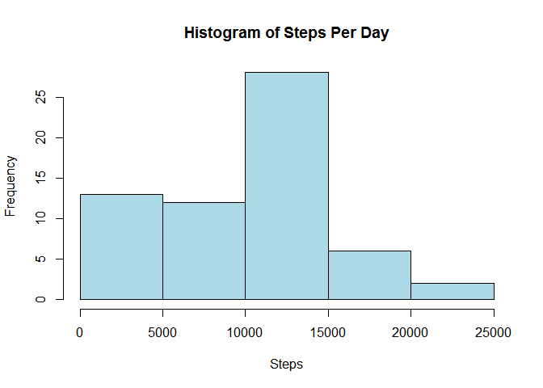
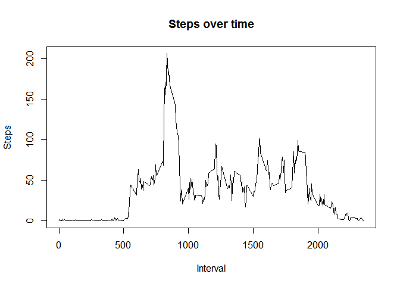
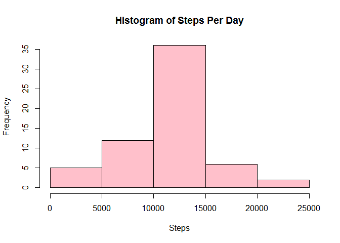
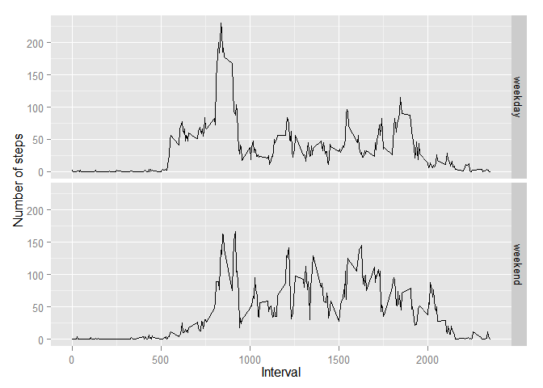

# activity

This dataset makes use of data from a personal activity monitoring device. This device collects data at 5 minute intervals 
through out the day. The data consists of two months of data from an anonymous individual collected during the months of 
October and November, 2012 and include the number of steps taken in 5 minute intervals each day. Each of the following
coding chunks answer the question in the list.

Read in the data and transform the data preparing for the plots.

```r
library(ggplot2)
```

```
## Warning: package 'ggplot2' was built under R version 3.1.2
```

```r
activity<-read.csv("activity.csv")
stepsPerDay<-aggregate(activity$steps, by=list(activity$date), FUN=sum, na.rm=T)
stepsInterval<-aggregate(activity$steps, by=list(activity$interval), FUN=mean, na.rm=T)
```
What is mean total number of steps taken per day?

```r
hist(stepsPerDay[,2], main="Histogram of Steps Per Day", xlab="Steps", ylab="Frequency", col="lightblue")
```

 

```r
meanSteps<-mean(stepsPerDay[,2])
meanSteps
```

```
## [1] 9354.23
```

```r
medianSteps<-median(stepsPerDay[,2])
medianSteps
```

```
## [1] 10395
```
What is the average daily activity pattern?

```r
plot(stepsInterval, type="l", main="Steps over time", xlab="Interval", ylab="Steps")
```

 

```r
stepsInterval[which.max(stepsInterval[,2]),1]
```

```
## [1] 835
```
Imputing missing values

```r
sum(is.na(activity$steps)) #Find the missing value
```

```
## [1] 2304
```

```r
#The following function impute the missing value
naInterval<-activity[is.na(activity$steps), 3]
imputeNA<-function(activity, naInterval){
  for (i in 1:nrow(activity)){
    if (is.na(activity[i,1])){
      for (j in 1:nrow(stepsInterval)){
        if (activity[i,3]==stepsInterval[j,1]){
          activity[i,1]<-stepsInterval[j,2]
        }
      }
    }
  }
  return(activity)
}
activityFill<-imputeNA(activity, naInterval) #Create a imputed dataset
stepsPerDayFill<-aggregate(activityFill$steps, by=list(activity$date), FUN=sum)
hist(stepsPerDayFill[,2], main="Histogram of Steps Per Day", xlab="Steps", ylab="Frequency", col="pink")
```

 

```r
meanStepsFill<-mean(stepsPerDayFill[,2])
meanStepsFill
```

```
## [1] 10766.19
```

```r
medianStepsFill<-median(stepsPerDayFill[,2])
medianStepsFill
```

```
## [1] 10766.19
```

```r
#The imputed dataset generates the same mean and median values, while the original dataset generates smaller mean than median value. The imputing missing values make the distribution tend to be normal.
```
Are there differences in activity patterns between weekdays and weekends?

```r
activityFill$weekday<-weekdays(as.Date(as.character(activityFill$date)))
activityFill$weekday<-ifelse(activityFill$weekday=="Saturday"|activityFill$weekday=="Sunday", "weekend", "weekday")
stepsIntervalFill<-aggregate(activityFill$steps, by=list(activityFill$interval, activityFill$weekday), FUN=mean)
ggplot(stepsIntervalFill, aes(Group.1, x, fill=Group.2))+geom_line()+facet_grid(Group.2~.)+labs(x="Interval", y="Number of steps")
```

 
